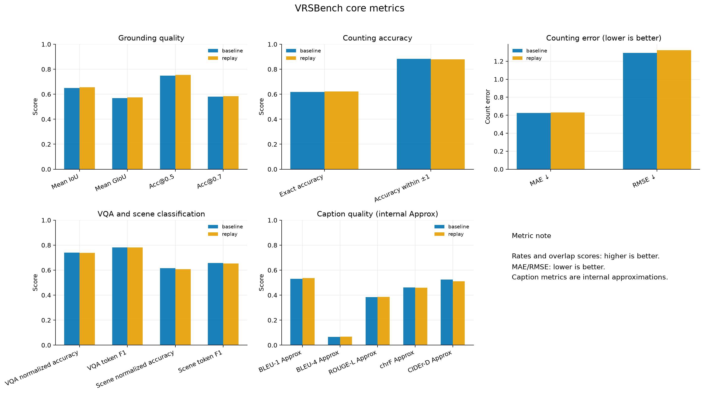
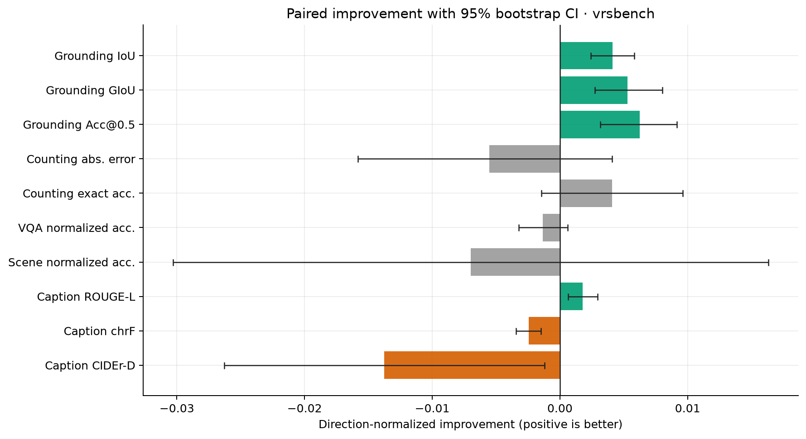
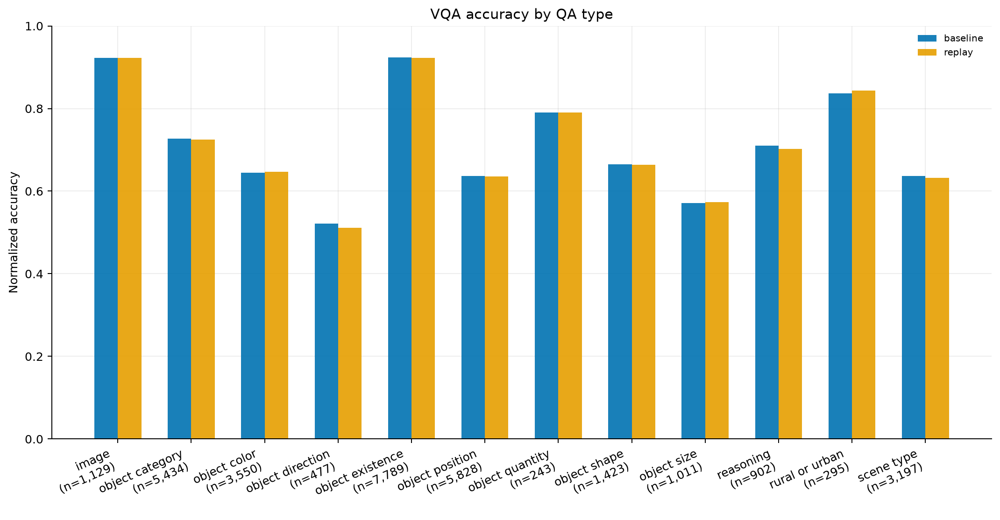
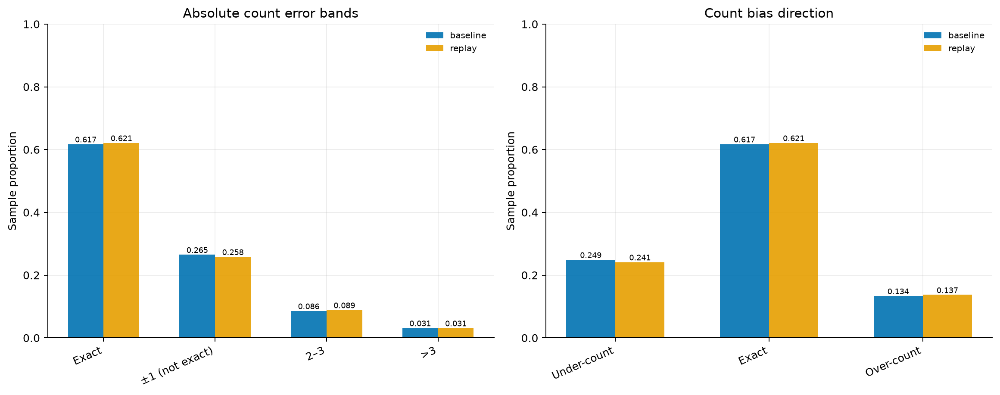
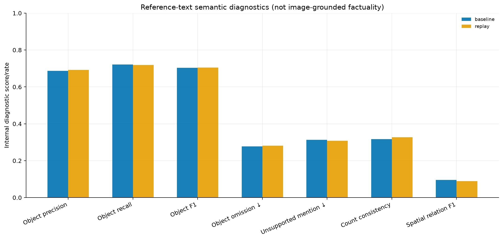
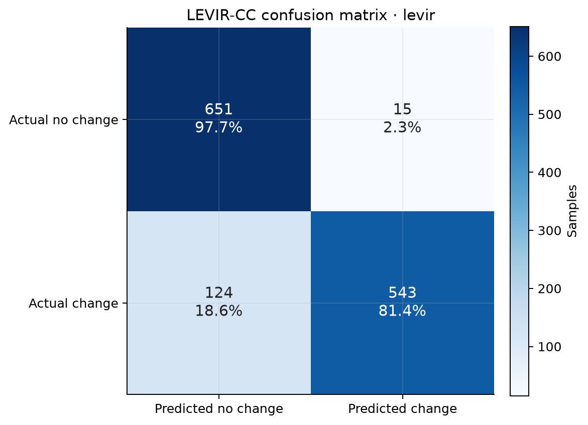

# 模型评测与绘图第一阶段结果

评测契约：v1.5。以下指标均为内部评测结果。

## 数据范围

| 对象 | 样本数 |
| --- | ---: |
| 原始VRSBench基线 | 62,918 |
| 加入LEVIR-CC回放后的VRSBench结果 | 62,918 |
| 回放后LEVIR-CC结果 | 1,333 |

两份VRSBench结果已完成ID、任务类型和参考答案的逐样本一致性检查。

## VRSBench结果摘要

| 任务 | 指标 | 基线 | 回放后 | 差值 |
| --- | --- | ---: | ---: | ---: |
| Grounding | Mean IoU | 0.650716 | 0.654847 | +0.004131 |
| Grounding | Mean GIoU | 0.568744 | 0.574045 | +0.005300 |
| Grounding | Acc@0.5 | 0.749087 | 0.755340 | +0.006253 |
| Counting | Exact Accuracy | 0.617354 | 0.621432 | +0.004078 |
| Counting | MAE | 0.625836 | 0.631382 | +0.005546 |
| VQA | Normalized Accuracy | 0.739394 | 0.738033 | -0.001361 |
| Caption | BLEU-1 Approx | 0.530951 | 0.536370 | +0.005419 |
| Caption | ROUGE-L Approx | 0.384993 | 0.386768 | +0.001775 |
| Caption | chrF Approx | 0.462214 | 0.459758 | -0.002455 |
| Caption | 单参考CIDEr-D Approx | 0.524119 | 0.510352 | -0.013767 |

配对Bootstrap结果表明Grounding获得稳定小幅改善；Counting、VQA和场景分类的主要区间跨0；Caption指标出现分化，不能表述为描述能力全面提升。

### VRSBench总体对比

Grounding四项核心指标均有小幅提高；Counting Exact Accuracy提高，但MAE和RMSE没有同步改善；VQA及场景分类变化较小；Caption不同指标方向不一致。

### 配对置信区间

横轴已统一转换为“正值代表改善”。绿色表示95%置信区间完全高于0，橙色表示完全低于0，灰色表示区间跨0。Grounding改善最稳定；Caption chrF和CIDEr-D出现确定性下降。

### 细粒度任务短板

VQA中方向、尺寸和位置相关问题弱于图像判断、对象存在及城乡类别问题，可作为后续数据增强的优先方向。各类型标签同时给出样本量，避免将小样本波动解释为稳定差异。

Counting主要错误集中在±1范围内；模型低估比例高于高估比例。回放后Exact比例略升，但大误差和总体MAE没有同步下降。

### 参考文本语义诊断

对象语义覆盖相对较好，空间关系F1明显偏低。这里的Unsupported Mention与Omission只相对参考文本计算，不能解释为图像级幻觉率或完整事实错误率。

## LEVIR-CC结果摘要

| 指标 | 数值 |
| --- | ---: |
| Accuracy | 0.895724 |
| Balanced Accuracy | 0.895785 |
| Change Precision | 0.973118 |
| Change Recall | 0.814093 |
| Change F1 | 0.886531 |
| MCC | 0.802272 |
| Cohen's Kappa | 0.791473 |
| TP/TN/FP/FN | 543 / 651 / 15 / 124 |

2026-08-11使用 `levir_relaxed_no_change_v2` 重新回放全部1,333条预测。新解析器支持0/1、结构化二分类值以及常见无变化表达变体，同时继续拒绝包含真实变化事件的复合否定句。本批预测的新旧判定逐样本完全一致，因此上述指标和图表保持有效；这也说明本批124条漏检并非由固定短语白名单造成。

主要问题是变化召回率：误报仅15条，但漏掉124条真实变化样本。

无变化样本召回率为97.7%，真实变化样本召回率为81.4%，模型呈现明显的保守判断倾向，后续应优先分析124条False Negative。

## 完整图集

本阶段统一绘图脚本实际生成12类固定图和1类条件延迟图，每类同时提供PNG与SVG：

| 图表 | 主要用途 |
| --- | --- |
| `task_sample_distribution` | 检查任务样本规模与类别不平衡 |
| `vrsbench_core_metrics` | 展示五类任务核心质量指标 |
| `grounding_iou_cdf` | 查看定位质量的完整分布及0.5/0.7阈值 |
| `counting_error_distribution` | 查看绝对误差和高估/低估方向 |
| `vqa_accuracy_by_type` | 定位VQA细分类短板 |
| `caption_quality_and_length` | 联合分析描述质量与长度变化 |
| `semantic_reference_text_diagnostics` | 分析对象、数量和空间关系文本一致性 |
| `paired_improvement_ci_vrsbench` | 判断模型差异是否稳定 |
| `win_tie_loss_vrsbench` | 查看逐样本改善、持平和退化比例 |
| `levir_cc_confusion_matrix` | 展示变化二分类错误来源 |
| `levir_cc_binary_metrics` | 汇总变化识别指标 |
| `levir_cc_caption_metrics` | 比较全样本和真实变化子集描述质量 |
| `inference_latency` | 在一致测量口径下比较Mean/P50/P95 |

生成清单、输入SHA256和跳过原因见 [`plot_manifest.json`](figures/v1.5/plot_manifest.json)。本次LEVIR-CC使用batch size 8，与两份VRSBench的batch size 16不同，因此未纳入延迟对比图；延迟图只比较口径一致的两份VRSBench结果。

## 当前限制

- 缺少回放训练前模型在同一LEVIR-CC验证集上的预测，暂不能给出变化能力的严格增量。
- LEVIR-CC当前每条预测只有一个参考描述，不能与五参考论文指标直接比较。
- Grounding缺少 `is_unique` 时不能进行官方Unique/Non-Unique分组。
- VQA缺少原始问题文本时不能实现问题感知语义Judge。
- 当前高级语义指标不是图像级事实正确率。

## 下一阶段

1. 分析LEVIR-CC的124个False Negative并建立错误类型清单。
2. 补跑回放训练前模型的同集LEVIR-CC预测并进行配对比较。
3. 接入压缩组INT8/INT4结果，绘制质量、显存和速度Pareto图。
4. 接入容错组fault/recovered结果，统一比较质量下降和恢复效果。
5. 在具备图像路径和完整标注后建立图像级事实正确率协议。
